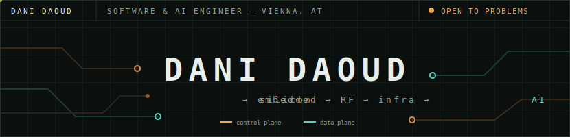

<p align="center">
  
</p>

I build systems from first principles — if I use something, I usually end up rebuilding it from scratch to understand it. CPUs, emulators, GPTs, mesh protocols.

Currently: Software Engineering Student @ **TU Wien**

```text
ABSOLUTE MAXIMUM RATINGS
─────────────────────────────────────────────
Stack depth ............ silicon → cloud
Lowest level shipped ... SKY130 ASIC tape-out
Highest level shipped .. RAG agents in prod
Routing decision ....... ~15 µs (custom mesh protocol)
Operating location ..... Vienna, AT
```

### Modules

| Ref | Project | What it is |
|-----|---------|------------|
| M1 | **Meshara / Synapse** | Dual-band mesh network — LoRa control plane + Wi-Fi HaLow data plane on ESP32-S3, custom geographic routing |
| M2 | **Humanoid teleop robot** | Tendon-driven hands, stereo vision, Quest 3 teleoperation, MoE action-tokenization for behavioral cloning |
| M3 | **Custom CPU → ASIC** | 8-bit RISC CPU from scratch, taped out on SKY130 via TinyTapeout |
| M7 | **From-scratch builds in C** | NES emulator, CHIP-8, mini GPT, neural net — no libraries, no magic |
| M13 | **Factorio in 3D** | Native 3D renderer injected into Factorio — reverse-engineered the game binary, a Rust DLL hooks engine functions by PDB symbol name and renders the world in real time through custom HLSL/Direct3D shaders |

<p align="center">
  
  
</p>

<p align="center">
  
</p>

<p align="center">
  <a href="https://gdani31.github.io/portfolio/">portfolio</a> ·
  <a href="mailto:danidaoud20@gmail.com">email</a>
</p>
